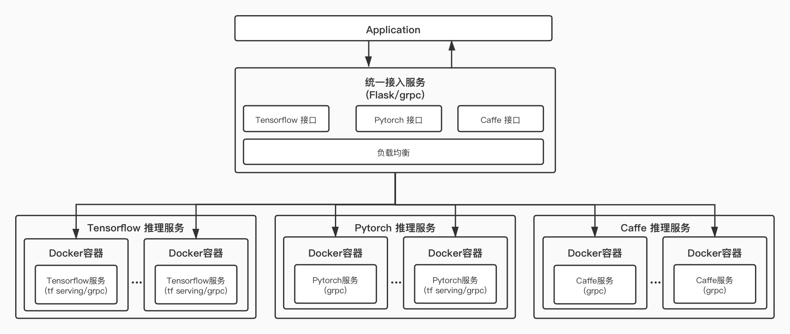

## 服务器情况
### 线上服务器
```
.
├── model_serving             # ml模型服务（gRPC服务）
│   ├── app
│   ├── conf
│   ├── logs
│   ├── README.md
│   ├── run_client.py
│   ├── run_service.py
│   └── test.py
├── qd_serving                # 负载均衡、业务服务（flask/gRPC服务）
│   ├── app
│   ├── conf
│   ├── logs
│   ├── README.md
│   ├── run.py
│   ├── grpc_run.py
│   └── test.py
├── README.md
├── QDModelServing.jpg


```

## 部署服务
```shell
docker-compose -f project_dir/start/docker-compose.yml up -d
or
docker-compose -f project_dir/docker/release/docker-compose.yml up -d
```



